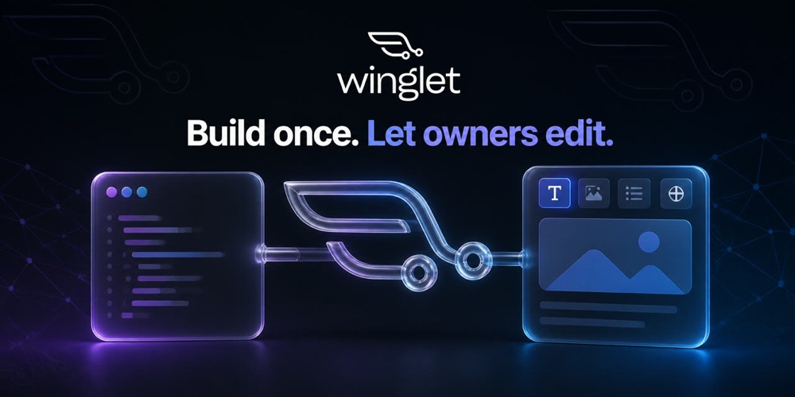
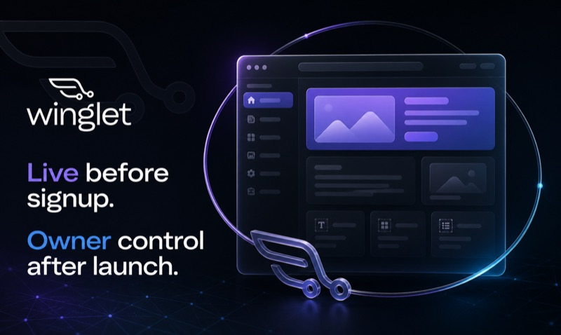
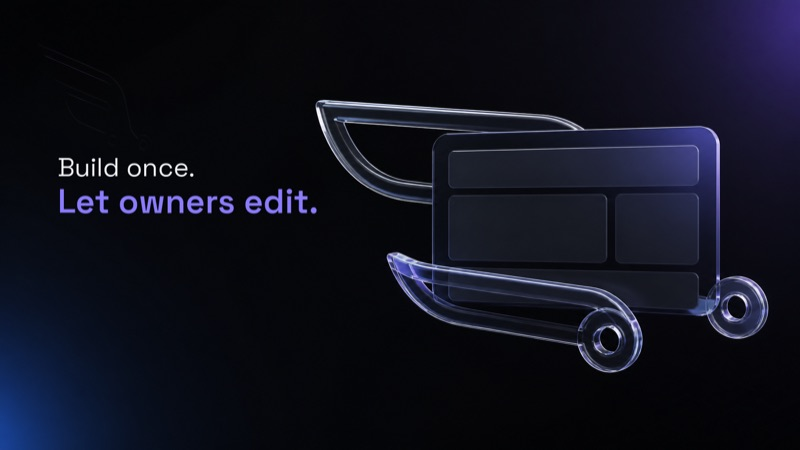
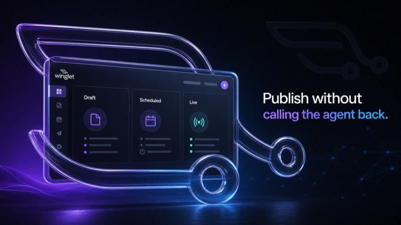

# Winglet — client tools



The open parts of an agent-first CMS: the SDK a site reads content with, the CLI
that wires a site up, the MCP server an agent edits through, and the agent skill
that teaches an agent to use all three.

The hosted service itself is closed. Everything here runs on **your** machine or
in **your** site, holds no credentials of ours, and is readable precisely because
you are the one running it.

## Install the skill

```bash
npx skills add dolevhayut/winglet-tools
```

Teaches an agent the content schema and which tool to reach for — CLI for setup
and batch work, MCP for in-conversation edits. Nothing to configure.

## Connect a site



```bash
npx winglet-cli init
```

Creates a content project, writes `.env.local`, generates types and prints one
link the site owner opens to start editing. No signup, no browser, no prompts —
safe to run unattended, and the only channel that works in CI, where there is no
conversation for an agent to have.

## Read content



```ts
import { getPage, getPosts } from 'winglet-next'

const home = await getPage('home')
```

Server components only. Content is fetched at build time, so the site keeps
serving even when our API does not.

## Edit as an agent



An MCP server exposes `list_documents`, `get_document`, `create_document`,
`update_document` and `publish` — five tools an agent can call mid-conversation,
without knowing any command syntax and without the site's repository checked out
on that machine. It costs context on every turn the tools are resident, which is
the trade-off against the CLI: reach for MCP for a point edit, the CLI for setup
or batch work.

```bash
claude mcp add winglet --transport http https://mcp.winglet.cloud/mcp
```

## Layout

| Path | What |
|---|---|
| `packages/sdk` | `winglet-next` — typed content client and typegen |
| `packages/cli` | `npx winglet` — init, types, pull, claim, usage, link |
| `packages/mcp` | MCP server, stdio and Streamable HTTP |
| `skills/winglet` | The agent skill |
| `product.config.ts` | The single source of the product's identity. **Canonical copy.** |

## Development

```bash
pnpm install && pnpm typecheck && pnpm test && pnpm build
```

`product.config.ts` lives here and nowhere else: every name, prefix and domain is
derived from one constant, and a guard fails the build if the name is ever typed
by hand.

## Licence, and where these come from

MIT. Each package carries its own copy.

They are on npm:

```
winglet-cli · winglet-next · winglet-mcp
```

To pin one by hand:

```jsonc
{
  "dependencies": {
    "winglet-next": "^0.3.1"
  }
}
```

**Unscoped, and the registry decided that rather than taste.** `@winglet` has
six packages published under it by an unrelated author and cannot be obtained.
The CLI had to be unscoped in any case: `npx <name>` resolves a PACKAGE of that
name, not a bin of that name inside a scope — and the bare product name is
refused too, as *too similar to the existing package `figlet`*. Hence
`npx winglet-cli init`, while the installed binary stays `winglet`, so every
command typed afterwards is unchanged.

Before publication these installed from release tarballs, which was the one form
every package manager accepts: npm and yarn cannot resolve a git subpath, and
pnpm refuses a git package's build script without an `onlyBuiltDependencies`
allowlist. Both problems disappear with a registry install, and so does the
allowlist a consumer used to need.

## Two tracks

These tools are the free half and they always will be. The service they talk to
comes two ways: a studio you host yourself, or a managed cloud at $49/year per
site that gets every new feature first. Same repository, same CLI — the cloud
asks for a token.
